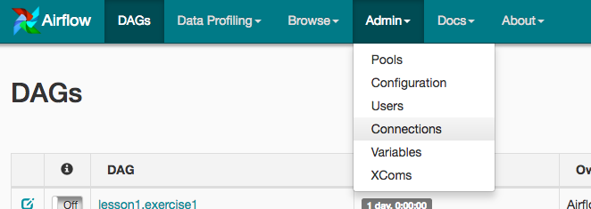
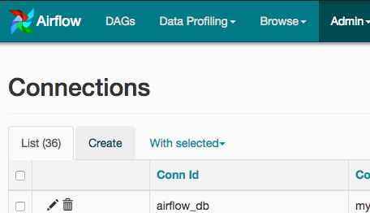

# DEND-Data_Pipeline_Airflow
## Loading S3 file with Airflow to ETL with Redshift

The purpose of this project is to build an adapted data model thanks to python to load data in a JSON file format and wrangle them into a star schema (see the ERD) with the pipeline written as a code thanks to [AirFlow](https://airflow.apache.org/).

### Prerequisite

1. Install [Docker](https://www.docker.com/get-started).

2. This project is run with **docker**.
    ```
    docker run -d -p 8080:8080 -v /path/to/project/dags:/usr/local/airflow/dags -v /path/to/project/plugins:/usr/local/airflow/plugins -v to/project/requirements.txt:/requirements.txt --name airflow puckel/docker-airflow webserver
    ```

And everything is setup to launch AirFlow.

3. You need also to configure your AWS credential with the AirFlow IU:

    We'll use Airflow's UI to configure your AWS credentials and connection to Redshift.

    1. Go to the Airflow UI:
    
    
    2. Under Connections, select Create.
    
    
    3. On the create connection page, enter the following values:

        * **Conn Id**: Enter `aws_credentials`.
        * **Conn Type**: Enter `Amazon Web Services`.
        * **Login**: Enter your **Access key ID** from the IAM User credentials you downloaded.
        * **Password**: Enter your **Secret access key** from the IAM User credentials you downloaded.
        
        Once you've entered these values, select Save and Add Another.


### Main Goal
The compagny Sparkify need to analyses theirs data to better know the way users (free/paid) use theirs services. With this data pipeline we will be able to schedule, monitor and build more easily the ETL of this data.

### Data Pipeline


This data pipeline is easy to read and understand even for a newcomer to AirFlow.

### Data Model

This pipeline finally is made to build this DB star schema below to make easier the data analysis


### Run it
Few steps

Go to the [AirFlow UI](http://localhost:8080/admin/) after several seconds after running your container.
